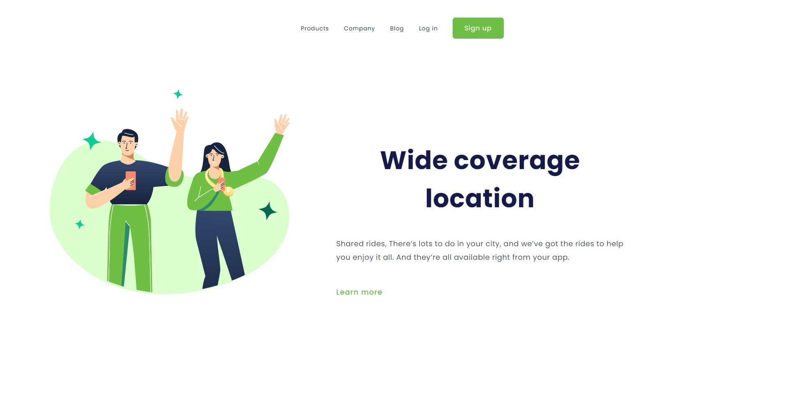
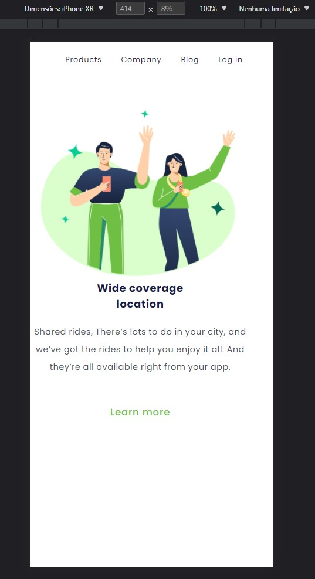

# Wide-coverage-location Interface

 #### 
 Esté projeto foi desenvolvido para Desktop e celulares

#### Ajustes e melhorias

O projeto ainda está em desenvolvimento e as próximas atualizações serão voltadas nas seguintes tecnologias:

- [x] HTML5 
- [x] CSS3 
- [x] ATUALIZAÇÃO DO LAYOUT 

